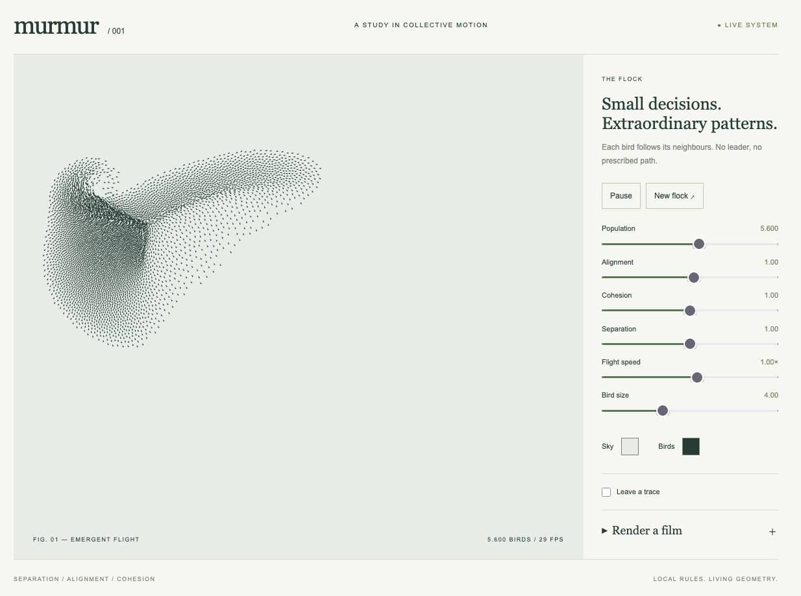

# Murmur

An interactive study of bird flocking. Watch thousands of simple shapes move together, tune their behaviour, leave fading traces, and save the motion as a video.

[Flocking](https://en.wikipedia.org/wiki/Flocking) is the coordinated movement of a group of birds. Here, each bird responds to its neighbours: staying close, matching their direction, and avoiding crowding. Together, these small decisions create flowing patterns without a leader.

**[Launch Murmur →](https://morishuz.github.io/murmur/)**

## Controls

- **Population:** choose 100–10,000 birds.
- **Alignment / Cohesion / Separation:** adjust how strongly birds follow their neighbours, gather together, and keep their distance.
- **Flight speed / Bird size / Sky / Birds:** change the pace, size and colours.
- **Pause / New flock:** freeze the scene or start a fresh flock.
- **Leave a trace:** enable thin trails, choose their colour, and adjust persistence from 0.5–10 seconds.
- **Render a film:** choose duration, frame rate, resolution and MP4 or WebM, then render and download your video.
